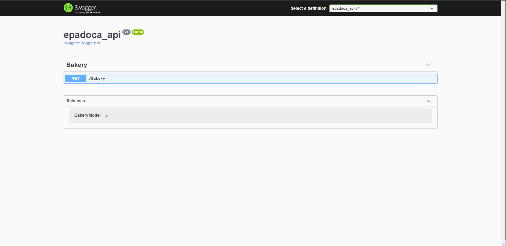

<a name="readme-top"></a>
<h1 align="center">epadoca-api</h1>

[![Contributors][contributors-shield]][contributors-url]
[![Forks][forks-shield]][forks-url]
[![Stargazers][stars-shield]][stars-url]
[![Issues][issues-shield]][issues-url]
[![LinkedIn][linkedin-shield]][linkedin-url]

<br />
<div align="center">
  <a href="https://github.com/Flaviojcf/epadoca-api">
    
  </a>


  <p align="center">
    This project is a solution to the epadoca challenge
    <br />
    <a href="https:/github.com/flaviojcf/epadoca-api" target="_blank"><strong>Explore the code »</strong></a>
    <br />
    <br />
  </p>
</div>

<details>
  <summary>Table of Contents</summary>
  <ol>
    <li>
      <ul>
        <li><a href="#built-with">Built With</a></li>
      </ul>
    </li>
    <li>
      <ul>
        <li><a href="#installation">Installation</a></li>
        <li><a href="#pre-requisites">Pre-requisites</a></li>
      </ul>
    </li>
    <li><a href="#contact">Contact</a></li>
  </ol>
</details>


### Built With
- [![.netWebApi][.net-api]][.net-api-url]
- [![SQL-Server][SQL-Server]][SQL-Server-url]


### Installation

1. Clone the repo
   ```sh
   git clone https://github.com/Flaviojcf/epadoca-api.git
   ```
2. <a href="#pre-requisites">Go to Pre-requisites</a>

3. In Visual Studio Code <br/>
    ```sh
    dotnet run
    ```
4. In Visual Studio
     ```sh
    Run the project
    ```

### Pre-requisites

- Intall the previous project and follow the tips
    ```sh
    https://github.com/Flaviojcf/epadoca-challenge/tree/master/epadoca-challenge
   ```
- Set the path to database and user informations in BakeryDAO.cs
   ```sh
   Example:"Data Source=path-database-example;Initial Catalog=database-name-example;User ID=user-id-example;Password=user-password-example";
  ```


## Contact

[@flavio_jCosta](mailto:flaviojcostafilho@gmail.com) - flaviojcostafilho@gmail.com

Project Link: [https://github.com/Flaviojcf/epadoca-challenge](https://github.com/Flaviojcf/epadoca-challenge)

<p align="right">(<a href="#readme-top">back to top</a>)</p>


[contributors-shield]: https://img.shields.io/github/contributors/flaviojcf/epadoca-challenge.svg?style=for-the-badge
[contributors-url]: https://github.com/flaviojcf/epadoca-challenge/graphs/contributors
[forks-shield]: https://img.shields.io/github/forks/flaviojcf/epadoca-challenge.svg?style=for-the-badge
[forks-url]: https://github.com/flaviojcf/epadoca-challenge/network/members
[stars-shield]: https://img.shields.io/github/stars/flaviojcf/epadoca-challenge.svg?style=for-the-badge
[stars-url]: https://github.com/flaviojcf/epadoca-challenge/stargazers
[issues-shield]: https://img.shields.io/github/issues/flaviojcf/epadoca-challenge.svg?style=for-the-badge
[issues-url]: https://github.com/flaviojcf/epadoca-challenge/issues
[linkedin-shield]: https://img.shields.io/badge/-LinkedIn-black.svg?style=for-the-badge&logo=linkedin&colorB=555
[linkedin-url]: https://www.linkedin.com/in/flávio-jcosta


[.net-api]: https://img.shields.io/badge/.NET-API-9017C0?style=for-the-badge&logo=.NETWebrk&logoColor=white
[.net-api-url]: https://learn.microsoft.com/pt-br/aspnet/web-api/overview/getting-started-with-aspnet-web-api/tutorial-your-first-web-api


[SQL-Server]: https://img.shields.io/badge/SQL-Server-67F7FF?style=for-the-badge&logo=SQL-Server&logoColor=white
[SQL-Server-url]: https://www.microsoft.com/pt-br/sql-server/sql-server-downloads
